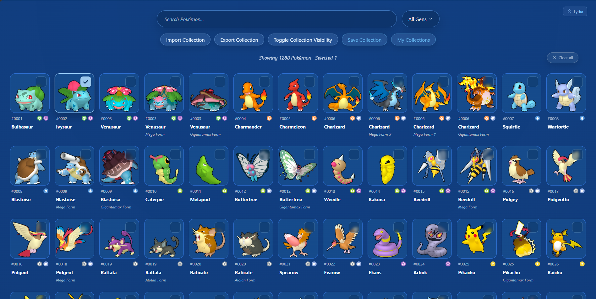

# Pokédex Collection Manager — Static

A personal Pokédex app for tracking your Pokémon collection, built as a fully static site deployable on GitHub Pages with no backend required.

**Live:** https://LydiaGarcia03.github.io/pokedex-collection-manager/



---

## Features

### Browsing
- Browse all 1242 Pokémon entries including regional forms, Mega Evolutions, and Gigantamax forms
- Search by name or Pokédex number
- Filter by generation (Gen I–IX)
- View detailed info per Pokémon: base stats, type effectiveness, abilities with descriptions, learnsets, and species data
- Browse TCG cards for each Pokémon with local images
- Track which games each Pokémon appears in

### Collection tracking
- Mark Pokémon as collected — toggle individual cards or track per TCG card and per game
- "Toggle Collection Visibility" mode highlights only collected Pokémon
- Clear all selections with confirmation

### Import / Export
- Export your collection as a text file (Pokémon only, with games, or with TCG cards)
- Import a previously exported collection file

### Cloud sync (requires login)
- Create an account or log in with email and password
- Save multiple named collections to the cloud via Firestore
- Load any saved collection back — on login, the most recently updated collection loads automatically
- Overwrite or delete saved collections from the "My Collections" panel

### Performance & security
- All images served locally — no external CDN calls at runtime
- Firebase App Check with reCAPTCHA v3 protects all Firebase calls from bots and abuse
- Firestore rules restrict each user's data to their own account only

---

## Tech Stack

| Layer | Technology |
|-------|-----------|
| UI | React 19 + TypeScript |
| Build | Vite 8 |
| Icons | Lucide React |
| Auth | Firebase Authentication (email/password) |
| Database | Firebase Firestore (cloud collection storage) |
| Security | Firebase App Check + reCAPTCHA v3 |
| Hosting | GitHub Pages (via GitHub Actions) |
| Data | Pre-compiled JSON + local images (~406 MB) |

---

## How It Works

All Pokémon data, TCG card metadata, and images are pre-processed locally and committed to the repository. At runtime the browser fetches a single JSON file (`pokemon-compiled.json`) and all images from the same GitHub Pages origin — no external API calls at runtime.

Collection state (selected Pokémon, cards, and games) is stored in `localStorage`. Logged-in users can additionally save and load named collections to Firestore, which syncs across devices.

Firebase App Check intercepts every Firebase SDK call and requires a valid reCAPTCHA v3 token. Requests without a valid token — including direct API calls that bypass the site — are rejected by Firebase before reaching Auth or Firestore.

---

## Data Sources

These APIs are called only during local setup steps — the deployed site makes no runtime API calls.

| API | Used for |
|-----|----------|
| [PokéAPI](https://pokeapi.co) | Pokémon data: stats, types, abilities, moves, species, game indices |
| [TCGdex](https://tcgdex.dev) | TCG card metadata and images |

---

## Environment Variables

Create a `.env.local` file at the project root (never commit this file):

```
VITE_FIREBASE_API_KEY=
VITE_FIREBASE_AUTH_DOMAIN=
VITE_FIREBASE_PROJECT_ID=
VITE_FIREBASE_STORAGE_BUCKET=
VITE_FIREBASE_MESSAGING_SENDER_ID=
VITE_FIREBASE_APP_ID=
VITE_RECAPTCHA_SITE_KEY=
```

For GitHub Pages deployment, add each of these as a repository secret under **Settings → Secrets and variables → Actions**.

---

## Project Setup (First Time)

> These steps are run once locally to generate and download all data before deploying.
> They require the sibling [`pokedex`](https://github.com/LydiaGarcia03/pokedex) project to exist at `../pokedex/`.

### 1. Install dependencies
```powershell
npm install
```

### 2. Compile Pokémon data
Reads source JSON files from the sibling project and produces `public/data/pokemon-compiled.json`.
```powershell
npm run compile-data
```

### 3. Collect TCG card metadata
Calls the TCGdex API (~900 requests, ~5 minutes) and produces `public/data/tcg-cards.json`.
```powershell
npm run collect-tcg
```

### 4. Download all images
Downloads ~1100 Pokémon sprites + ~18300 TCG card images (~400 MB total). Skips files already downloaded.
```powershell
npm run download-images
```
Estimated time: ~20 minutes.

### 5. Commit data and images
```powershell
git add public/data/pokemon-compiled.json
git add public/data/tcg-cards.json
git add public/data/type-chart.json
git add public/images/
git commit -m "Add compiled data and local images"
git push
```

GitHub Actions builds and deploys to GitHub Pages automatically on push to `main`.

---

## Development

```powershell
npm run dev
```

Opens at `http://localhost:5175`. No backend needed — all data is served from `public/`.

In development, Firebase App Check uses a debug token instead of reCAPTCHA. On first run, the browser console prints:

```
App Check debug token: <uuid>
```

Register this token in **Firebase Console → App Check → [your app] → Manage debug tokens** so local auth works without reCAPTCHA.
